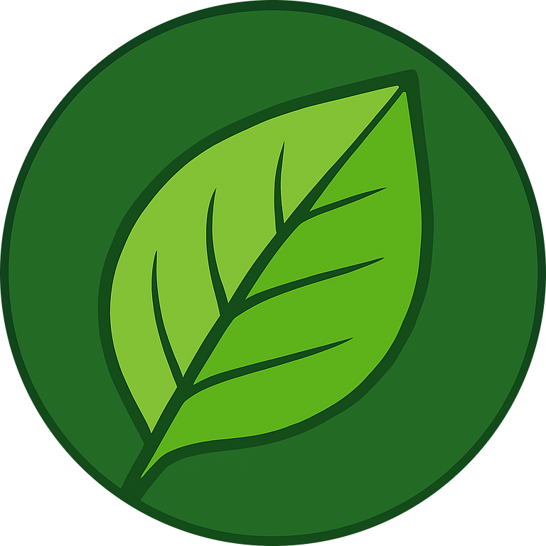

<h1 align="center">Recyclica-AI</h1>

<p align="center">
  
  <br>
  <em>An AI-powered waste classification and disposal recommendation system.
    <br> Upload an image of waste, and get the best possible method for responsible disposal.</em>
  <br>
</p>

<br>

## Demo

<video src="images/demo.mp4" controls autoplay loop muted style="width:100%; height:auto;">
</video>
<br><br>


## Development Setup


### Clone Repository

```
git clone https://github.com/rispar0529/Recyclica-AI.git
cd Recyclica-AI
```
<br><br>

### Backend Setup(FastAPI)
<br>

**Navigate to Backend Directory**

```
cd backend
```
<br>

**Generate Gemini Key**
```
1. Visit [Google AI Studio](https://aistudio.google.com/app/apikey)  
2. Sign in with your Google account  
3. Click **Create API Key** and copy it
```

<br>

**Create virtual environment:**


```
//Windows
python -m venv venv
venv\Scripts\activate

//macOS/Linux
python3 -m venv venv
source venv/bin/activate
```
<br>

**Install Dependencies**

```
pip install -r requirements.txt
```
<br>

**Create Environment file**

```
//Create .env file in backend directory
echo "GEMINI_API_KEY = your_actual_gemini_api_key_here" > .env
```
(Replace `your_actual_gemini_api_key_here` with your own gemini key)

<br>

**Start the backend server**:
 ```bash
 uvicorn app.main:app --reload --host 127.0.0.1 --port 8000
 ```

 <br><br>

 ### Frontend Setup(Next.js)
 <br>

 **Open a new terminal and navigate to frontend directory:**
 ```
 cd frontend
 ```
 <br>

 **Install dependencies:**
 ```
 npm install
 ```
<br>

**Create environment file:**
 ```
 // Create .env.local file in frontend directory
echo "NEXT_PUBLIC_API_URL=http://127.0.0.1:8000" > .env.local
```
<br>

**Start the development server:**
```
npm run dev
```

The frontend will be available at: `http://localhost:3000`
<br><br>

## Usage

1. **Start the application**  
Open your browser and go to: [http://localhost:3000](http://localhost:3000)

2. **Upload an image of organic waste**  
  You can provide an image by:  
   - Clicking the upload area to select a file  
   - Dragging and dropping an image into the upload area  
   - Taking a photo directly with your device camera  

3. **Analyze the waste**  
   Click Get Eco Solutions to process the image and identify the waste.

4. **View results**  
   The system will display:  
   - Waste type identification  
   - Environmental impact details 
   - Step-by-step disposal or composting instructions  
   - Sustainability benefits


